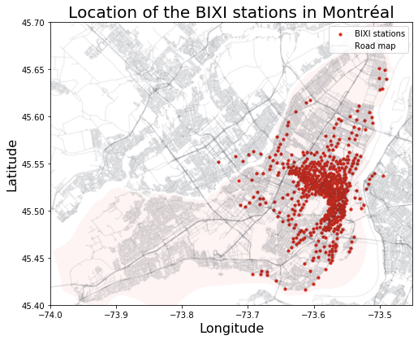

# BIXI Project
This project is part of the Capstone project for the [Data Engineering Nanodegree](https://www.udacity.com/course/data-engineer-nanodegree--nd027). 

This project aims to better understand how weather (e.g. temperature, rain) impacts the number of biking rides completed by BIXI users, a sharing bike company located in Montréal, Canada. 

**Mains steps of this project:**
1.  First, I will develop a data engineering pipeline to load and transform the required data in a more usable data schema

2. Next, I will explore different analytics questions such as:
	- Is there a correlation between the temperature and amount of bike ride?
	- Does temperature has a bigger impact on workers (mon-fri during rush hour) than on leisure users (sat-sun during the afternoon)?

3. Finaly, I want to use machine learning to predict amount of BIXI trips based on temperature 

# Project Steps

## Step 1: Scope the Project and Gather Data

In this first and important step, I selected the dataset necessary to answer the questions defined above. Exploration of the dataset was completed using Pandas and some vizualisation tools (e.g. matplotlib, geopandas). 

### [Datasets & Exploration](data_exploration.ipynb)
First, I took data from BIXI and found some complementary weather data matching the time period of BIXI activity. Since winter is full of snow and cold, BIXI only opperates its bikes from mid-april to the end of November based on snow conditions.

BIXI has many logs per day, thus, I only used data from 2020 to explore the datasets (e.g. variables, missing values). 

**BIXI data**:
- [BIXI open-data](https://bixi.com/fr/donnees-ouvertes)
	- Yearly and monthly logs of trips completed
	- Location of all the BIXI stations

**Weather**:
- [Montreal Climate - Historical Data](https://climate.weather.gc.ca/historical_data/search_historic_data_e.html) 
	- Hourly and daily weather in Montreal