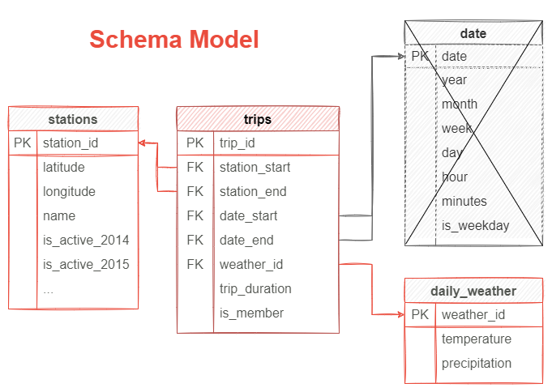

# BIXI Project

**Technologies, libraries and frameworks I used:**

- Python, Jupyter Notebook
- Pandas
- SQL
- Apache Airflow
- Amazon Web Service (AWS):
	- S3
	- Redshift

 

This project is part of the Capstone project for the [Data Engineering Nanodegree](https://www.udacity.com/course/data-engineer-nanodegree--nd027). 

This project aims to better understand how weather (e.g. temperature, rain) impacts the number of biking rides completed by BIXI users, a sharing bike company located in Montréal, Canada. 

**Mains steps of this project:**
1.  First, I will develop a data engineering pipeline to load and transform the required data in a more usable data schema

2. Next, I will explore different analytics questions such as:
	- Is there a correlation between the temperature and amount of bike ride?
	- Does temperature has a bigger impact on workers (mon-fri during rush hour) than on leisure users (sat-sun during the afternoon)?

3. Finaly, I want to use machine learning to predict amount of BIXI trips based on temperature 

# Project Steps

## [Scope the Project, Gathering Data & Exploration](Data Exploration.ipynb)

In this first and important step, I selected the dataset necessary to answer the questions defined above. Exploration of the dataset was completed using Pandas and some vizualisation tools (e.g. matplotlib, geopandas). 

### Datasets & Exploration
First, I took data from BIXI and found some complementary weather data matching the time period of BIXI activity. Since winter is full of snow and cold, BIXI only opperates its bikes from mid-april to the end of November based on snow conditions.

BIXI has many logs per day, thus, I only used data from 2020 to explore the datasets (e.g. variables, missing values). But for the full pipeline, I used data from 2018 to 2020.

**BIXI data**:
- [BIXI open-data](https://bixi.com/fr/donnees-ouvertes)
	- Yearly and monthly logs of trips completed
	- Location of all the BIXI stations

**Weather**:
- [Montreal Climate - Historical Data](https://climate.weather.gc.ca/historical_data/search_historic_data_e.html) 
	- Hourly and daily weather in Montreal
    
    
## [Data Modeling & Pipeline Planification](Data Modeling and Data Pipeline.ipynb)

In this second step, I started to plan how I would model the data to facilitate the analytics goals defined above. 

I choose a star-schema since I had one main information (BIXI logs) and many secondary datasets linked to these logs (weather, station, date) and not all analyses requires the same secondary datasets. More details can be found in the [Notebook](Data Modeling and Data Pipeline.ipynb). In the end, I skipped the date format since it was working pretty well without it and felt useless for the desired queries, but looking foward to adding new data to this schema!

Based on this schema, I outlined the different steps I will take to create the data pipeline of this project. 

## [Pipeline Creation](BIXI_pipeline.py)

**Creation of the pipeline with Apache Airflow**
The following operators are ready: 

	✓ Transforming XLM files (for weather) into CSV since redshift does not support easily XLM files
	
	✓ Transfering local files to S3
	
	✓ Creating empty tables (fact + dimensions + staging) in Redshift

	✓ Load data into staging table and transform them into fact and dimension table

	✓ Drop staging table once we are done using them

	✓ Quality checks (x2): no empty table and location of stations are in Montreal

## D.E. Project Write-Up

What if...

- **The data was increased by 100x.** Imagine if we had more cities with BIXI or different brand of bike sharing around the world. We could switch to a data Lake and work with Spark and S3. This would allow to store different types of format (e.g. different company have different types of logs)

- **The pipelines would be run on a daily basis by 7 am every day.** Imagine we would like to update each day the logs with the ones from yesterday. In this case, we could adapt our Apache Airflow pipeline to load new data every morning and compute our analyses for the day.

- **The database needed to be accessed by 100+ people.** Using AWS is perfect for that since it allows many users to work on the same data. 